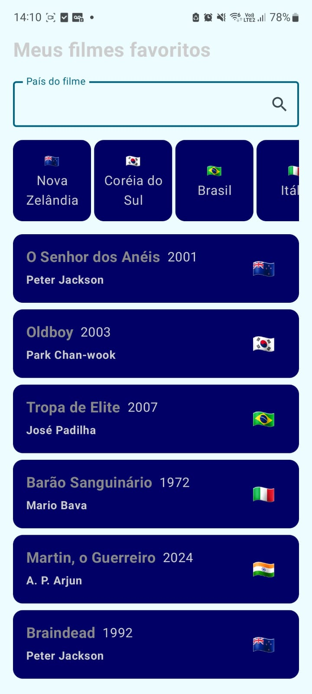

# Meus filmes favoritos - Checkpoint 2 Android

Lucas de Lima - 98632

Felipe Cortez - 550282

## Screenshots

 

## Stack Utilizada

- Kotlin
- Android Studio
- Gradle
- Jetpack Compose

## Estrutura do projeto (simplificada)

```
├───kotlin+java
   └───lucaslimb.com.github.jetpackcomposecp2
           ├───components
           ├───model           
           ├───repository    
           ├───ui.theme        
           └───MainActivity.kt                             
```
